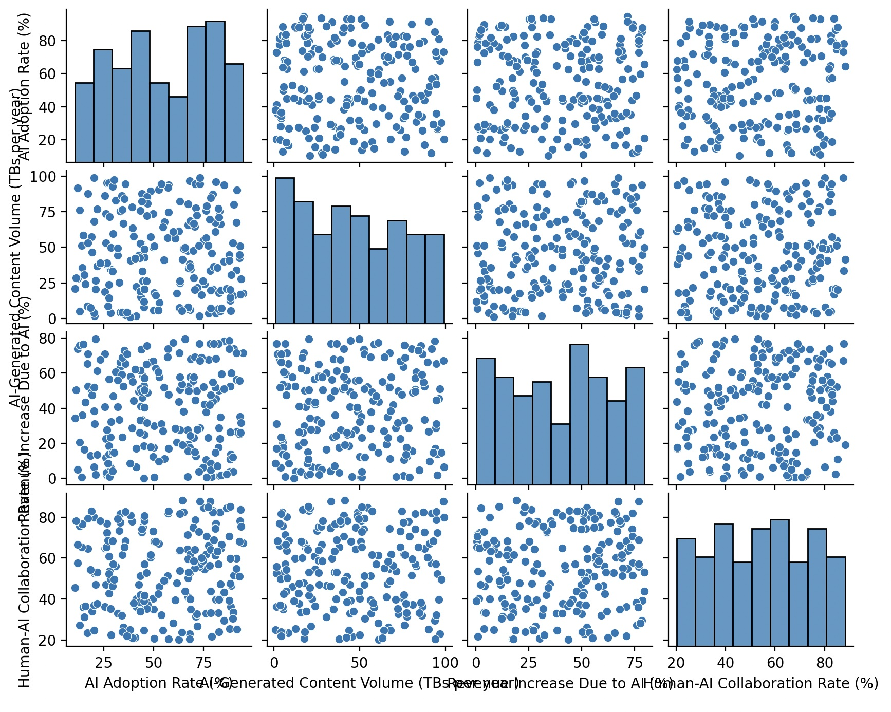

# Human-AI Collaboration Analysis

This project explores how AI adoption, AI-generated content, and revenue growth impact the level of human-AI collaboration across countries.

For full analysis, methodology, and visualizations, please refer to the PDF report:  
[**project_report.pdf**](./project_report.pdf)

---

## Project Highlights

- Multiple linear regression to identify key predictors of human-AI collaboration
- Correlation heatmap and scatterplots for variable relationships
- Python-based analysis using real-world data

## Data Cleaning Process

- Dropped rows with missing or null values using `pandas.dropna()`
- Verified column consistency and data types
- Final dataset: 200+ clean observations across multiple countries

---

##  Tools & Libraries

- Python 3.13
- pandas
- seaborn
- matplotlib
- statsmodels

---
## Sample Results

**Correlation Heatmap**


**Scatter Plot of Key Variables**



##  How to Run

```bash
pip install -r requirements.txt
python main.py
